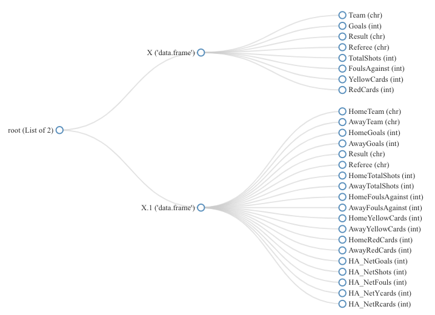
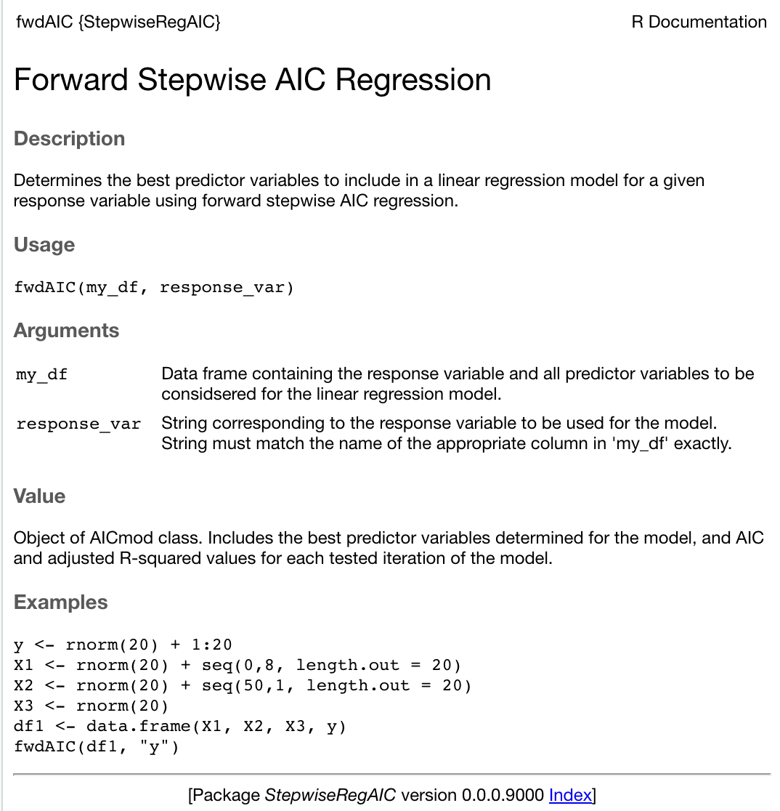

```{r setup, include=FALSE}
knitr::opts_chunk$set(echo = TRUE)
```

# Part 1: Analysis - English Premier League Data

## 1.1 Introduction

For the analysis section of this project, I have chosen to look at data relating to the English Premier League, the top tier football competition in England. More specifically, the data set I am using will be comprised of game data from ten different csv files corresponding to each football season between the years 2009 and 2019 [1].

Each file contains information on every game played in the related season, including the referee name, the participating teams, the number of goals scored, the number of fouls committed, and the number of yellow and red cards received by each team.

From the available data, I will focus on a subset of variables of particular interest to me and perform a general analysis on the data in order to identify any interesting trends that may exist. Next, I will analyse the data with respect to individual teams, in order to determine how each team ranks in terms of various metrics, for example the highest overall win percentage. Finally, I plan to investigate a claim which is often quoted in footballing circles yet I have never seen clear evidence to support it - that well known referee Martin Atkinson is biased against Liverpool football club.

After completing the analysis above, the results from each section of analysis will be summarised and discussed briefly, and finally I will discuss the observed results and any conclusions that can be drawn from them.

\newpage

## 1.2 Analysis

### 1.2.1 Reading and Pre-Processing the Data

The data for the project is contained within 10 separate csv files, each with an identical column structure. The *mergeFiles* function below takes a file path, corresponding to the path of the folder where the files are stored, as an input. The function ignores all files in the specified folder which don't start with the string "season-" to ensure only the English Premier League data files are read.

Each csv file is read individually and saved to a list, and the *Reduce* function is then used to sequentially apply the *merge* to each element of the list, returning a single data frame containing all the data from the 10 input files.

As the data set contains a relatively large number of columns, I have chosen to omit several columns from the analysis, so these can be dropped from the data frame.

```{r load data}
# load libraries
library("knitr")

# set folder path (file is saved in "Data" folder where markdown file is saved)
folderpath = paste(getwd(), "/Data",sep="")

# create function to merge files into a single data frame
mergeFiles = function(mypath){
  # merge files starting with the string "season-" (in case other files are in the data folder)
  filenames = list.files(path = mypath, full.names = TRUE, pattern = "^season-")
  # read each csv file and save in a list
  datalist = lapply(filenames, 
                   function(x){read.csv(file = x, header = TRUE, stringsAsFactors = FALSE)})
  # sequentially apply merge function to each element of our list to create a single data frame
  Reduce(function(x,y) {merge(x, y, all = TRUE)}, datalist)
}

# call mergeFiles function to create data frame of all csv files
EPL_raw <- mergeFiles(folderpath)
# drop all columns after column 23 (betting info, not of interest for this project)
EPL <- EPL_raw[1:23]
# drop other unwanted columns
EPL <- EPL[-c(1:2, 8:10, 14:15, 18:19)]

# print column names
names(EPL)
```

\newpage

As can be seen above, the majority of the column names are not descriptive and are difficult to interpret. Thankfully, a description for each of the column abbreviations contained in the data set can be found on-line [2].

Data from the first 5 rows of the data set is displayed below. For convenience, the data has been displayed in a transposed format to prevent columns from printing over multiple lines.

```{r cont}
# give columns more sensible names
names(EPL) <- c("HomeTeam", "AwayTeam", "HomeGoals", "AwayGoals", 
                "Result", "Referee", "HomeTotalShots", "AwayTotalShots", 
                "HomeFoulsAgainst", "AwayFoulsAgainst", "HomeYellowCards", 
                "AwayYellowCards", "HomeRedCards", "AwayRedCards")

# print first 3 rows of data frame
kable(t(EPL[1:5, 1:14]))
```
\newpage

### 1.2.2 Visulaising the numeric data

### Pairs plots

Pairs plots are an effective method of visually comparing multiple numeric columns at the same time. They create a grid of scatter plots, plotting every combination of variables against each other. As there is a relatively large number of variables in our data set, we can combine each home and away pair of columns and create a new factor column to describe whether each row in the data frame contains home or away data. Separate colours can then be used on the pairs plot to distinguish between home and away data.

```{r pairs plot}
# get numeric columns from data frame
nums <- unlist(lapply(EPL, is.numeric)); EPL_num <- EPL[nums]
# create separate home and away data frames (to reduce total number of columns)
homeEPL <- EPL_num[, grep("^Home", colnames(EPL_num))]
names(homeEPL) <- c("Goals", "TotalShots", "FoulsCommitted", "YellowCards", "RedCards")
homeEPL$HomeAway = "Home"
awayEPL <- EPL_num[, grep("^Away", colnames(EPL_num))]
names(awayEPL) <- c("Goals", "TotalShots", "FoulsCommitted", "YellowCards", "RedCards")
awayEPL$HomeAway = "Away"
# merge home and away data
homeaway_data <- merge(homeEPL, awayEPL, all=TRUE)
# create vector of 1s and 2s corresponding to home and away 
vectorHomeAway <- NA
vectorHomeAway[homeaway_data$HomeAway == "Home"] <- 1
vectorHomeAway[homeaway_data$HomeAway == "Away"] <- 2

# plot pairs plot with home and away data in separate colours
pairs(homeaway_data[-c(6)], cex=0.3, pch = c(3,4)[vectorHomeAway], lwd=0.2,
      col = c(rgb(0.4,1,1, alpha = 0.3), rgb(1,0.2,0.2, alpha = 0.3))[vectorHomeAway])
```

\newpage

Many of the numeric columns in the data only feature a small number of unique values. As a result, there is significant overlap in the data when plotted on the scatter plots above. One way to deal with this is to add jitter to the data in the data frame, which adds a small amount of noise to each value. The *jitter* function can be applied to each column using *lapply*.

A number of other additions can be made to the pairs plot to improve it, such as a title, a legend and smoothed trend lines on each plot. These trend lines can be particularly useful to assist with quickly visualizing trends, in particular when there is significant variance in the data and a trend is not immediately apparent when observing a scatterplot.

```{r pairs plot jitter}
# add jitter to each column of the dataframe
df_jitter<- data.frame(lapply(homeaway_data[-c(6)], jitter))

# plot paris plot again
pairs(df_jitter[-c(6)], cex=0.3, 
      col = c(rgb(0.4,1,1, alpha = 0.3), rgb(1,0.2,0.2, alpha = 0.3))[vectorHomeAway],
      pch = c(3,4)[vectorHomeAway], 
      main = "Pairs Plot of Numeric Data with Home/Away Data Visible",
      oma=c(3,3,6.5,8), lwd=0.2, panel = panel.smooth)

# Allow objects to be drawn outside plotting region
par(xpd=TRUE)
# Plot legend to the top right of the pairs plot
legend("right", legend = c("Home","Away"),
       col=c(rgb(0.4,1,1, alpha = 0.7), rgb(1,0.2,0.2, alpha = 0.7))[vectorHomeAway],
        pch = c(3,4)[vectorHomeAway], cex = 0.5)
```

\newpage

### Summary statistics

Summary statistics for each column, including mean, median and quartile values, can be obtained using the *summary* function as shown below.

From inspecting the mean values returned for each column, we can see that home advantage appears to be a significant factor in the data, with the average number of goals and total shots from home teams both greater than the equivalent values for away teams, and with the number of fouls committed, number of yellow cards and number of red cards all lower for home teams than for away teams.

```{r summary stats}
# plot summary statistics for numeric columns
summary(EPL_num)
```
\newpage

### Boxplots

Boxplots can be used to visualise the distributions of variables, while also displaying the median, first quartile and third quartile values to allow simple comparisons of different variable distributions. The variables below have been ordered by their median values, making it easier to compare the centre of each variable's distribution.

```{r boxplots, fig.height=7}
# create order vector of columns ordered by median
ord <- order(sapply(EPL_num,median))
# Plot boxplot
boxplot(EPL_num[ord], las=2, main = "Boxplots of Numeric Variables",
        cex.axis = 0.4, col = rainbow(length(EPL_num)), ylab = "Value")
```

\newpage

### Histograms

Histograms are another form of plot that can be used to visualise the distribution of numeric variables, and determine which values occur most frequently.

```{r hist density plots}
# set plot window to 2 rows by 3 columns
par(mfrow=c(2,3))

# drop Home/Away column from data frame so all data is numeric
df_num <- homeaway_data[-c(6)]

# create histogram of each column
for (i in 1:length(df_num)){
  hist(df_num[,i], xlab = colnames(df_num)[i], 
       main = paste("Histogram of\n", colnames(df_num)[i]),
       cex.main=1, col=rainbow(length(df_num))[i], breaks = seq(-1,max(df_num[,i])))
}
```

\newpage

### Frequency tables and barplots

Frequency tables can be used to visualise categorical variable information. The table below shows the frequencies of each result type for the data set, with 'A' corresponding to a win for the away team, 'H' a win for the home team, and 'D' a draw.
The barplot below conveys the same information from the frequency table. Barplots make it easier to visualise the magnitude of each frequency in the table.

```{r freq tables and barplots}
# create frequency table of result column
kable(table(EPL$Result))

# increase LHS margin of plot for labels
par(mar=c(4,8,4,2))
# create barplot of frequency table data
barplot(table(EPL$Result), col = rainbow(3), names.arg = c("Away Win", "Draw", "Home Win"), 
        main = "Barplot of Frequency of Results", xlab = "Frequency", horiz=TRUE, las=1)
```

There is a clear difference between the number of wins by home teams and away teams, a further indication that home advantage was a contributing factor in the data.

\newpage

### 1.2.3 Modelling the data with known distributions

Another thing that can be looked at for our numeric data is whether any common distributions can effectively model each individual variable. For this analysis, we will look at the number of goals scored by each team, the number of yellow cards issued, the number of fouls committed and the total shots takes by each team, and we will look at Poisson, Hurdle and normal distributions to determine which best fits each variable's distribution.

### Poisson distribution model

The *poissonLogLike* function below returns the log-likelihood value for a variable when modelled using a Poisson distribution. The inbuilt *dpois* function can be used in this case to calculate the density for each value in the given variable.

```{r Poisson LogLike}
# poisson distribution log likelihood function (param = lambda)
poissonLogLike <- function(param, values) return(sum(log(dpois(values, param))))
```

### Hurdle distribution model

No inbuilt function is available in base R to calculate a Hurdle distribution density value, so a custom function can be created to achieve this. The *dhurdle* function below takes and input value or vector of values, and a *param* vector containing the $\theta$ and $\lambda$ values for the desired distribution, and returns the Hurdle probability desnity value. A log likelihood function for the Hurdle distribution is also defined below.

```{r Hurdle LogLike}
dHurdle <- function(x, param) {
  # param[1] = theta, param[2] = lambda
  # set P(x) to a vector of zeros the length of x initially
  Px = rep(0, length(x))
  
  # checks that theta is a probability (i.e. between 0 and 1)
  if (param[1] >= 0 & param[1] <= 1) {
    # loop through all elements in x  
    for (i in 1:length(x)) {
      # check what value of x[i] is and calculate corresponding P(x) value 
      if (x[i] == 0) {
          # if x = 0, P(x) = theta 
          Px[i] = param[1]
        } else if (x[i] > 0) {
          # if x > 0, evaluate for P(x)
          Px[i] = (1 - param[1]) * ((param[2]^x[i]) * exp(-param[2])) /
            (factorial(x[i]) * (1 - exp(-param[2])))
        } else {
          # if x < 0, print warning message
          print("Can't evaluate for negative values of x!")
        } # x[i] if else ]
    } #i for loop
  } #theta if check
  
  return(Px)
}
# calculate log-likelihood for Hurdle model
hurdleLogLike <- function(param, values) return(sum(log(dHurdle(values, param))))
```
\newpage

### Normal distribution model

Again, a density function is already available for normal distributions, *dnorm*. A third log-likelihood function is defined below to calculate the log-likelihood value for a normal distribution with given mean and standard deviation values.

```{r Normal LogLike}
# calculate log-likelihood for normal distribution
normLogLike <- function(param, values) return(sum(log(dnorm(values, mean=param[1], sd=param[2]))))
```

### Plotting histograms and distribution curves

A single function can now be created to take an input vector, calculate the optimum parameters for each of the three distributions of interest, and plot a histogram of the data with each of the calculated distribution curves overlaid.

```{r distribution plotting function}
distributionPlot <- function(data) {
  # get name of input object in string format, extract column name (after '$')
  dataString <- deparse(substitute(data))
  dataString <- gsub(".*[$]", "", dataString)

  # calculate mean and standard deviation of data
  dataMean <- mean(data); dataSD <- sd(data)
  # get optimum lambda value for Poisson distribution (should equal mean)
  optimResP <- optimise(poissonLogLike, c(dataMean*0.5, dataMean*1.5), values=data, maximum = TRUE)
  # get vector of Poisson distributed values between 0 and max(data)
  poisvec <- dpois(seq(0, max(data)), optimResP$maximum) 
  
  # get optimum theta and lambda values for Hurdle distribution
  optimResH <- optim(par=c(exp(-dataMean), dataMean), fn = hurdleLogLike, values = data, 
                          control = list(fnscale=-1))
  # get vector of Hurdle distributed values between 0 and max(data)
  hurdvec <- dHurdle(seq(0, max(data)), optimResH$par)

  # get optimum mean and sd values for normal distrbution
  optimResN <- optim(par=c(dataMean, dataSD), fn = normLogLike, values = data, 
                          control = list(fnscale=-1))
  # get vector of normally distributed values between 0 and max(data)
  normvec <- dnorm(seq(0,max(data)), optimResN$par[1], optimResN$par[2])

  # get frequency table of data, set plot ymax to 1.5 times the max density value
  freq <- table(data); ymax <- max(freq)/sum(freq)*1.5
  # plot histogram with line of each distribution overlaid
  hist(data, freq = FALSE, breaks = seq(-1, max(data)), col=rgb(0.5,0.5,0,0.05), ylim = c(0, ymax), 
       main = paste("Histogram of", dataString), xlab = dataString, border = rgb(0.1,0.1,0.1,0.1))
  lines(seq(0, max(data)), hurdvec, col=rgb(0,0.8,0,0.7), type='l', lwd=2, lty=1)
  lines(seq(0, max(data)), poisvec, col=rgb(1,0,0.7), type='l', lwd=2, lty=2)
  lines(seq(0, max(data)), normvec, col=rgb(0,0,1,0.5), type='l', lwd=2, lty=4)
  # add legend to plot
  legend("topright", legend = c("Hurdle", "Poisson", "Normal"),
       col=c(rgb(0,0.8,0,0.7), rgb(1,0,0,0.6), rgb(0,0,1,0.5)), lwd = 2, lty=c(1,2,4))
  return(c(dataMean, dataSD, optimResP$maximum, optimResH$par[1], 
           optimResH$par[2], optimResN$par[1], optimResN$par[2]))
  }
```
\newpage

Using the function created above, we can look at a number of different variables from our data, and plot their histogram along with a best fit Poisson, Hurdle and normal distribution curve, as shown below.

```{r testing distribution plots function, fig.height=7}
# set plot window to 2 rows x 2 columns
par(mfrow=c(2,2))
# call distributionPlot function for all relevant data columns
distGoals <- distributionPlot(homeaway_data$Goals)
distYCs <- distributionPlot(homeaway_data$YellowCards)
distShots <- distributionPlot(homeaway_data$TotalShots)
distFouls <- distributionPlot(homeaway_data$FoulsCommitted)
```

\newpage

### 1.2.4 Team Specific Analysis

It is also possible to analyse the data with respect to the individual teams featured in the data set. Below, a new data frame (*dfTeams*) has been created with a single row for each team. A number of interesting metrics can be calculated from the data, such as overall win percentage, the average of net goal difference, net shots, net fouls committed and net cards received for each individual team, as done below.

```{r win precentage per team}
# create columns of net figures (home minus away)
EPL$HA_NetGoals <- EPL$HomeGoals - EPL$AwayGoals
EPL$HA_NetShots <- EPL$HomeTotalShots - EPL$AwayTotalShots
EPL$HA_NetFouls <- EPL$HomeFoulsAgainst - EPL$AwayFoulsAgainst
EPL$HA_NetYcards <- EPL$HomeYellowCards - EPL$AwayYellowCards
EPL$HA_NetRcards <- EPL$HomeRedCards - EPL$AwayRedCards

# get vector of all teams in the data set, ordered alphabetically
Teams <- sort(unique(EPL$HomeTeam))
# create new data frame, let first column equal the uniqueTeams vector
dfTeams <- data.frame(Teams)

# create NULL vectors for win% and net figure columns per teams
winPercentCol <- NULL; netGoalsCol <- NULL; netFoulsCol <- NULL;
netYCsCol <- NULL; netRCsCol <- NULL;

# loop through each team in the data
for (team in Teams) {
  # calculate sum of total wins for current team (home or away)
  teamWins <- sum((EPL$HomeTeam==team & EPL$Result=="H") | (EPL$AwayTeam==team & EPL$Result=="A"))
  # calculate sum of total games for current team (home or away)
  teamTotalGames <- sum(EPL$HomeTeam==team | EPL$AwayTeam==team)
  # calculate win% for current team, append to vector
  winPercent <- teamWins / teamTotalGames * 100
  winPercentCol <- c(winPercentCol, winPercent)
  
  # calculate mean of net goals scored for the current team, append to vector
  # note: minus number when team played away as original figure is (home minus away)
  netGoals <- mean(EPL$HA_NetGoals[EPL$HomeTeam==team]) - mean(EPL$HA_NetGoals[EPL$AwayTeam==team])
  netGoalsCol <- c(netGoalsCol, netGoals)
  # calculate mean of net fouls committed for the current team, append to vector
  # note: minus number when team played away as original figure is (home minus away)
  netFouls <- mean(EPL$HA_NetFouls[EPL$HomeTeam==team]) - mean(EPL$HA_NetFouls[EPL$AwayTeam==team])
  netFoulsCol <- c(netFoulsCol, netFouls)
  # calculate mean of net yellow cards received for the current team, append to vector
  # note: minus number when team played away as original figure is (home minus away)
  netYCs <- mean(EPL$HA_NetYcards[EPL$HomeTeam==team]) - mean(EPL$HA_NetYcards[EPL$AwayTeam==team])
  netYCsCol <- c(netYCsCol, netYCs)
  # calculate mean of net red cards received for the current team, append to vector
  # note: minus number when team played away as original figure is (home minus away)
  netRCs <- mean(EPL$HA_NetRcards[EPL$HomeTeam==team]) - mean(EPL$HA_NetRcards[EPL$AwayTeam==team])
  netRCsCol <- c(netRCsCol, netRCs) } 

# create new columns in data frame, equal to newly created vectors
dfTeams$WinPC <- winPercentCol; dfTeams$NetGoals <- netGoalsCol; 
dfTeams$NetFouls <- netFoulsCol; dfTeams$NetYC <- netYCsCol; dfTeams$NetRC <- netRCsCol
```

\newpage

### Overall win percentage

One method of quantifying the success of each team in our data set over the past 10 years is to calculate the overall percentage of games that they won. The barplot below illustrates the win percentage of each team that featured in the premier league in at least one season over the past 10 years, ordered from highest win percentage to lowest.

The plot highlights a notable gap between the top 6 teams, who all have a win percentage above than 50 percent, while each of the remaining teams have a win percentage below 40 percent.

```{r win percentage}
# plot barplot of total win percentage for each club, from highest to lowest
barplot(dfTeams$WinPC[order(-dfTeams$WinPC)], ylab = "Percentage", las=2, cex.names = 0.5,
        col = rev(heat.colors(length(dfTeams$Teams))), 
        names.arg = dfTeams$Teams[order(-dfTeams$WinPC)],
        main = "Overall Win Percentage per Football Team")
```

\newpage

### Net goal difference

Another metric that can help visualise the success of a team is net goal difference, which can be calculated by subtracting the number of goals scored by each team from the number of goals conceded.

The first table below lists the top 6 teams in terms of net goal difference. Unsurprisingly, the listed teams are the same 6 teams with the highest win percentage, albeit with a slightly different order.

```{r net goals top 6}
# print top 6 teams in terms of net goal difference
kable(head(dfTeams[order(-dfTeams$NetGoals), c("Teams", "NetGoals")]))
```

The bottom 6 teams in terms of net goal difference are shown in the table below. Again, there is significant overlap between these teams and the 6 teams with the lowest win percentage, with the exception of Middlesbrough who had the lowest overall win percentage but do not feature in the bottom 6 teams in terms of net goal difference.

```{r net goals bottom 6}
# print bottom 6 teams in terms of net goal difference
kable(tail(dfTeams[order(-dfTeams$NetGoals), c("Teams", "NetGoals")]))
```

\newpage

### Discipline

Several different metrics can be considered when assessing how disciplined a football teams is, for example the number of fouls committed, number of yellow and red cards received and number of penalties conceded. As a number of factors can affect the overall number of fouls committed and cards issued in a given game, such as the strictness of the referee and weather conditions, it can also be useful to consider the overall net fouls, net yellow cards and net red cards when assessing the discipline of a team.

It is difficult to quantify discipline in a single number as there are so many factors that contribute to it. However, given the available data, I will try to quantify discipline of each team by considering a combination of their net fouls, net yellow cards and net red cards. To ensure equal weighting of each of these factors, each variable can be standardised to give a distribution with a mean value of zero and standard deviation of one. For each team, the average value of these three standardised figures gives an indication of how disciplined they were, with lower values corresponding to better discipline. For convenience, I will refer to the metric which combines the standardised net fouls and net yellow and red cards as the *Discipline Score*, with low negative values corresponding to good discipline and high poistive values corresponding to poor discipline. 

The table below shows the 6 most disciplined teams in the data based off the criteria specified above. Bournemouth is a noticeable outlier in the data, with a value over two standard deviations below the mean value.

```{r discipline top 6}
# standardise net fouls and net cards columns and calculate average of the 3 columns
dfTeams$DisciplineScore <- (scale(dfTeams$NetFouls) + 
                             scale(dfTeams$NetYC) + 
                             scale(dfTeams$NetRC)) / 3

# print top 6 teams in terms of overall discipline
kable(head(dfTeams[order(dfTeams$DisciplineScore), 
                   c("Teams", "NetFouls", "NetYC", "NetRC", "DisciplineScore")]))
```

Conversely, the 6 teams with the poorest discipline are shown in the table below, with Middlesbrough, Watford, Tottenham and Reading all having a value greater than one standard deviation above the mean.

```{r discipline bottom 6}
# print bottom 6 teams in terms of overall discipline
kable(tail(dfTeams[order(dfTeams$DisciplineScore), 
                   c("Teams", "NetFouls", "NetYC", "NetRC", "DisciplineScore")]))
```

\newpage

### 1.2.5 Referee Bias

We can also analyse the data with respect to the referees who oversaw each game in the data set. This analysis will focus specifically on Liverpool Football Club, and will aim to identify if clear bias is shown by any referee in favour of or against Liverpool, with particular focus on referee Martin Atkinson.

Firstly, a data frame containing only matches where Liverpool featured can be obtained by filtering out rows where Liverpool were neither the home nor away team. A frequency table can be used to determine how many games each referee in the data set oversaw, as shown below. A number of referees in this table oversaw very few Liverpool games, and as such there is a higher likelihood that any results relating to them will be skewed. To overcome this, only referees who oversaw at least 10 Liverpool games in the data will be considered when analysing referee bias.

```{r Liverpool data frame}
# get data frame only including games featuring Liverpool
dfLiv <- EPL[EPL$HomeTeam=="Liverpool" |EPL$AwayTeam=="Liverpool",]
# create frequency table for referees in Liverpool data frame
table(dfLiv$Referee)
# get vector of refs in data set with at least 10 appearances, ordered alphabetically
Referees <- (sort(unique(dfLiv$Referee)))[table(dfLiv$Referee)>=10]
# drop rows with referees that feature less than 10 times
dfLiv <- dfLiv[dfLiv$Referee %in% Referees,]
```

### Win percentage

One high level method of assessing a referee's bias against a team is to compare the team's win percentage during games that the referee oversaw with the overall win percentage of the team. While there are various factors that can affect the final result of any individual game, more so than the influence of a referee, it is likely that there will be some significant variation in Liverpool's win percentage under each referee in the data set. However, a significant difference between the win percentage under a particular referee and the overall mean win percentage could suggest an element of bias introduced to the results by the referee.

The Liverpool win percentage under each referee has been calculated below and plotted on a barplot, along with a horizontal line indicating the overall mean win percentage for Liverpool. To facilitate the easy identification of Martin Atkinson on the barplot, the bar corresponding to Liverpool's win percentage in games he oversaw has been coloured green.

```{r refs Liverpool win percentage}
# create new data frame, let first column equal the uniqueTeams vector
dfRefs <- data.frame(Referees)
# create NULL vector for win% per referee
LivWinCol <- NULL

# loop through each team in the data
for (ref in Referees) {
  # calculate sum of total Liverpool wins for current referee (home or away)
  LivWins <- sum((dfLiv$HomeTeam=="Liverpool" & dfLiv$Result=="H" & dfLiv$Referee==ref) |
                   (dfLiv$AwayTeam=="Liverpool" & dfLiv$Result=="A" & dfLiv$Referee==ref))
  # calculate total number of games for Liverpool (home or away)
  LivTotalGames <- sum(dfLiv$Referee==ref)
  # calculate win% for current team, append to vector
  LivWinPercent <- LivWins / LivTotalGames * 100
  LivWinCol <- c(LivWinCol, LivWinPercent)}

# create new column in data frame, equal to Liverpool win% per referee
dfRefs$LivWinPC <- LivWinCol

# create colour vector for barplot, with Martin Atkinson in green
colvec <- heat.colors(length(dfRefs$Referees))
colvec[dfRefs$Referees[order(dfRefs$LivWinPC)]=="M Atkinson"] <- "green"
# plot barplot of Liverpool win percentage for each referee, from highest to lowest
barplot(dfRefs$LivWinPC[order(dfRefs$LivWinPC)], ylab = "Percentage", las=2, cex.names = 0.5,
        col = colvec, 
        names.arg = dfRefs$Referees[order(dfRefs$LivWinPC)], 
        main = "Liverpool Win Percentage per Referee")
# draw line at overall mean win% value for Liverpool
abline(h = dfTeams$WinPC[dfTeams$Teams=="Liverpool"]);
# draw text on mean line
text(x = 5, y = dfTeams$WinPC[dfTeams$Teams=="Liverpool"], 
     labels = paste("Liverpool Mean Win Percentage: ", 
                    round(dfTeams$WinPC[dfTeams$Teams=="Liverpool"], 2), "%", sep = ""), 
     pos = 3, cex = 0.6)
```

\newpage

### Discipline

Another method of assessing a referees bias against a team is to look at the *Discipline Score* defined earlier for the team in games overseen by each individual referee. Again the discipline takes the average value of the standardised net fouls (number of fouls against the team minus number of fouls against the opposing team), the standardised net yellow cards (number of yellow cards received by the team minus number of yellow cards received by the opposing team) and the standardised net red cards (number of red cards received by the team minus number of red cards received by the opposing team). Standardising and taking the average of these three metrics gives an equal weighting to each metric in the final *Discipline Score* value.

In general, a positive *Discipline Score* value indicates that more fouls are committed and cards are issued to a given team than their opponents on average, while a negative *Discipline Score* value indicates that less fouls are committed and less cards are issued to a given team than their opponents on average. 

Below, a barplot displays Liverpool's *Discipline Score* value under each referee that oversaw at least 10 of their games in the data set, again with Martin Atkinson identified using a green coloured bar.

```{r refs Liverpool discipline}
# create NULL vectors for net figure columns per referees
LivNetFoulsCol <- NULL; LivNetYCsCol <- NULL; LivNetRCsCol <- NULL;

for (ref in Referees) {
  # calculate sum of total Liverpool wins for current referee (home or away)
  LivWins <- sum((dfLiv$HomeTeam=="Liverpool" & dfLiv$Result=="H" & dfLiv$Referee==ref) |
                   (dfLiv$AwayTeam=="Liverpool" & dfLiv$Result=="A" & dfLiv$Referee==ref))
  
  # calculate mean of Liverpool net fouls for the current referee, append to vector
  # note: minus number when team played away as original figure is (home minus away)
  LivNetFouls <- mean(dfLiv$HA_NetFouls[dfLiv$HomeTeam=="Liverpool" & dfLiv$Referee==ref]) -
    mean(dfLiv$HA_NetFouls[dfLiv$AwayTeam=="Liverpool" & dfLiv$Referee==ref])
  LivNetFoulsCol <- c(LivNetFoulsCol, LivNetFouls)
  
  # calculate mean of Liverpool net yellow cards for the current referee, append to vector
  # note: minus number when team played away as original figure is (home minus away)
  LivNetYCs <- mean(dfLiv$HA_NetYcards[dfLiv$HomeTeam=="Liverpool" & dfLiv$Referee==ref]) -
    mean(dfLiv$HA_NetYcards[dfLiv$AwayTeam=="Liverpool" & dfLiv$Referee==ref])
  LivNetYCsCol <- c(LivNetYCsCol, LivNetYCs)
  
  # calculate mean of Liverpool net red cards received for the current referee, append to vector
  # note: minus number when team played away as original figure is (home minus away)
  LivNetRCs <- mean(dfLiv$HA_NetRcards[dfLiv$HomeTeam=="Liverpool" & dfLiv$Referee==ref]) -
    mean(dfLiv$HA_NetRcards[dfLiv$AwayTeam=="Liverpool" & dfLiv$Referee==ref])
  LivNetRCsCol <- c(LivNetRCsCol, LivNetRCs) 
}

# create new columns in data frame, equal to newly created vectors
dfRefs$LivNetFouls <- LivNetFoulsCol; dfRefs$LivNetYC <- LivNetYCsCol; 
dfRefs$LivNetRC <- LivNetRCsCol

# standardise Liverpool net fouls and net cards columns, calculate average of the 3 columns
dfRefs$LivStdNetFoulCard <- (scale(dfRefs$LivNetFouls) + 
                             scale(dfRefs$LivNetYC) + 
                             scale(dfRefs$LivNetRC)) / 3  

# drop rows with NAs (cases where a referee hasn't overseen at least 1 home and 1 away game)
dfRefs <- na.omit(dfRefs)

# create colour vector for barplot, with Martin Atkinson in green
colvec <- rev(heat.colors(length(dfRefs$Referees)))
colvec[dfRefs$Referees[order(dfRefs$LivStdNetFoulCard)]=="M Atkinson"] <- "green"

# create barplot of Liverpool discipline rating per referee
barplot(dfRefs$LivStdNetFoulCard[order(dfRefs$LivStdNetFoulCard)], las=2, cex.names = 0.5, 
        col = colvec, names.arg = dfRefs$Referees[order(dfRefs$LivStdNetFoulCard)], 
        main = "Liverpool Discipline per Referee", ylab = "Discipline Score")

```

\newpage

## 1.3 Results

### Analysis of Home and Away data

The table below lists the mean values for home and away teams for number of goals scored, total number of shots attempted, fouls committed, yellow cards received and red cards received. In general, home teams appear to perform better than away teams, scoring 0.4 more goals, taking 3 more shots, and winning 17% more games on average than away teams. 

Home teams also appear to receive a certain level of preferential treatment, conceding 0.5 less fouls and receiving 0.3 less yellow cards per game on average than away teams.

```{r away vs home, echo=FALSE}
# create vectors of mean values for Home and Away stats, and (Home - Away)
Home <- colMeans(EPL_num)[seq(1, ncol(EPL_num), 2)]
Away <- colMeans(EPL_num)[seq(2, ncol(EPL_num), 2)]
Difference <- Home - Away
# create data frame from home and away vectors
df <- data.frame(Home, Away, Difference)
# 
AwayWinPC <- table(EPL$Result)["A"]/sum(table(EPL$Result))*100
HomeWinPC <- table(EPL$Result)["H"]/sum(table(EPL$Result))*100
#
df[nrow(df)+1,] <- c(HomeWinPC, AwayWinPC, HomeWinPC - AwayWinPC)

# replace Home in rownames with Mean
rownames(df) <- sub("Home", "Mean", rownames(df))
rownames(df)[nrow(df)] <- "MeanWinPercentage"

df <- round(df, 2)
# print table of Home and Away mean values
kable(df)
```

### Analysis of data distributions

The table below summarises the mean, standard deviation, and optimum parameters values calculated for Poisson, Hurdle and Normal distribution models for each of the variables tested in section 1.2.3.

As expected, the optimum $\lambda$ values calculated for each Poisson distribution were equal to the mean value of the associated variable. Likewise, the optimum mean and standard deviation parameters calculated for each Normal distribution were equal to the mean and standard deviation of associated variables.

```{r distributions, echo=FALSE}
df2 <- round(data.frame(distGoals, distYCs, distShots, distFouls), 4)
rownames(df2) <- c("Mean", "Standard Deviation", "Poisson: opt. lamba",
                  "Hurdle: opt. theta", "Hurdle: opt. lamba", 
                  "Normal: opt. mean", "Normal: opt. stand. dev.")
kable(df2)
```

Looking at the histograms and distribution plots in section 1.2.3, both the Hurdle and Poisson modelled distributions appear to be sufficient for modelling the distributions of the goals, yellow cards and fouls data. However they fail to accurately model the shots data. The normal distribution is more effective at modelling the shots data, as well as the fouls data, but it does not perform as well as the Poisson and Hurdle models when modelling the goals and yellow cards data.

\newpage

### Team specific analysis

As noted earlier, there is a significant difference in the overall win percentage statistics between the 6 top performing football teams in England over the past 10 years who all achieved an average win percentage greater than 50 percent, and the remaining teams who's percentages were all below 40 percent.

A similar trend was witnessed when looking at net goal difference for each team in the data, with the same 6 teams achieving the highest figures once again.

When analysing the discipline of each team based on the net number of fouls committed, net yellow cards received and net red cards received, there was some level of overlap between the top performing teams and the most disciplined teams, with Arsenal, Chelsea and Tottenham all featuring in the top 6 of both categories.

### Analysis of referee bias

The table below shows the standardised win percentage for Liverpool per referee, and the "discipline score" for Liverpool per referee, as visualised earlier in the plots in section 1.2.5.

While Liverpool's win percentage in games overseen by Martin Atkinson is lower than their overall mean winning percentage, a standardised win percentage value of 0.24 standard deviations below the mean for games which he was in charge would suggest that he does not have a significant influence on the results of Liverpool's games. More notably, Liverpool's win percentage in games overseen by Howard Webb was 2.2 standard deviations below their overall mean win percentage, indicating a stringer likelihood of Howard Webb having an influence on Liverpool's results than Martin Atkinson.

Liverpool's "discipline score" under each referee is shown in the *LivStdNetFoulCard* column in the table, and interestingly this value is negative for Martin Atkinson suggesting that he gives more fouls against and issues more cards to Liverpool's opponents on average than to Liverpool, so again, there is no clear evidence of bias demonstrated here. Alternatively, Peter Walton's discipline score is almost 1.6 standard deviations above the mean, suggesting that he punishes Liverpool more than their opponents at a higher rate than any other referee.

```{r standardised Liverpool ref win percentages, echo=FALSE}
dfRefs$scaledLivWinPC <- scale(dfRefs$LivWinPC)
kable(dfRefs[order(dfRefs$LivStdNetFoulCard), c("Referees", "scaledLivWinPC", "LivStdNetFoulCard")])
```


\newpage

## 1.4 Conclusions

A number of conclusions can be drawn from the data analysis above with relatively high confidence. Firstly, and unsurprisingly, there is a clear advantage for home teams in the English Premier League, with home teams winning at a higher rate, attempting more shots and scoring more goals on average than away teams. There is also some evidence of referees being biased in favour of home teams, calling fouls and issues cards to away teams at a higher rate than to home teams. 

However, it is not clear from the available data whether that is related to additional pressure from the home crowd, or if it is a result of home teams dominating games more frequently than away teams and having a greater amount of possession, which in turn could result in away teams having to tackle more often and potentially commit more fouls. This would be an interesting area of further research, and obtaining data on attendance, possession and tackle count statistics could help identify what is the greater contributing factor to the greater number of fouls committed and cards received by away teams.

From the distribution modelling section of the analysis, the distributions of the number of goals scored, yellow cards issued and fouls committed by each team could all be modelled successfully using both Poisson models and Hurdle models. The goals and yellow cards data didn't appear to follow a normal distribution, but the distribution of the number of fouls committed could also be successfully be described using a normal distribution, and the total number of shots also appeared to follow a distribution similar to a normal distribution, albeit slightly more right skewed. Overall, the three distribution models considered during this analysis appear sufficient for modelling the distributions of the Premier League goals, yellow cards, shots and fouls data.

The most significant finding from the team specific analysis was the apparent gap between the "Big Six", the top six team in the Premier League over the past decade, and the remaining teams. While it was expected that these six teams would have the been the top performing teams in the data, the magnitude of the gap between these teams and the remaining teams was somewhat unexpected, with over 10% of a difference between the win percentage of the sixth best performing team and next best team. This is likely due to the high level of consistency shown by each of the "Big Six" over the past decade, with other teams rarely achieving a top six position.

Finally, from the available data there is no clear evidence to suggest that Martin Atkinson is biased against Liverpool football club. While Liverpool's win percentage in games that he oversaw was slightly slower than their overall win percentage, it was not significant to a level that would suggest bias against them. When considering Liverpool's "discipline score" under each referee, again there was no significant evidence of bias from Atkinson against Liverpool. 

However, we would ideally consider various other factors when assessing whether any evidence of bias exists in Martin Atkinson's refereeing of Liverpool games, but for this project we were limited by the available data in the data set. Data on the number of penalties awarded for and against Liverpool, and more recently data relating to the number of decisions overturned by VAR could also provide a useful insight into the level of bias shown by a given referee against a given team, and would be interesting areas of future analysis.

## 1.5 References

[1] *English Premier League (football) - Data Files*. Retrieved from [https://datahub.io/sports-data/english-premier-league](https://datahub.io/sports-data/english-premier-league). Accessed 7^th^ Dec. 2020.

[2] *Key to results data*. Retrieved from [http://www.football-data.co.uk/notes.txt](http://www.football-data.co.uk/notes.txt). Accessed on 7^th^ Dec. 2020.

\newpage

# Part 2: R Package - DataExplorer

## 2.1 Introduction

### 2.1.1 Overview

Exploratory Data Analysis (EDA) is a process frequently used in data science applications when performing initial investigations on a dataset. It is an essential part of any effective data analysis workflow, helping data scientists to summarise the contents and main characteristics of datasets, detect mistakes and missing values in the data, visualise relationships between variables in the data, and determine suitable explanatory and dependent variables for statistical modelling. As Exploratory Data Analysis covers such a broad range of analysis techniques, it is typically the most time-consuming element in data science.

The ***DataExplorer*** package aims to simplify this process, providing functions to perform various EDA techniques on entire datasets using minimal lines of code, and to automate the entire EDA process [1]. This package focuses on three specific tasks relating to data analysis:

1. Exploratory Data Analysis
2. Feature Engineering
3. Data Reporting

Below, these tasks will be explored in detail to highlight some of the main functions provided by the *DataExplorer* package for each task, with numerous examples and visualisations using data from the English Premier League data set from part 1.

### 2.1.2 Package Installation

Before the *DataExplorer* package can be used, it must be installed. The package is not currently available on the CRAN repository [2], but the latest version of the package can be installed using the command below.

```{r installing DataExplorer package, eval=FALSE}
remotes::install_github("boxuancui/DataExplorer")
```

Please note that the above command is not evaluated in the current notebook as I have already previously installed this package.

Once the package has been installed, it can be loaded into the notebook using the *library* function. The plotting functions within the *DataExplorer* package are based on the *ggplot2* library, so this can also be loaded into the notbook.

```{r import DataExplorer library}
library("DataExplorer")
library("ggplot2")
```

\newpage

### 2.1.3 Data

To facilitate with the demonstration of the *DataExplorer* package's functionality, a subset of the English Premier League dataset from part 1 will be used. The *EPLhome* data frame below is a copy of the *EPL* data frame from part 1, but with all "Away" columns removed. The top 6 rows from this data frame are displayed below.

```{r eda1}
# create data frame with all "Home" columns from EPL data frame
EPLhome <- EPL[, c("HomeTeam", "HomeGoals", "Result", "Referee", "HomeTotalShots",
                   "HomeFoulsAgainst", "HomeYellowCards", "HomeRedCards")]
# remove Home from column names
names(EPLhome) <- gsub("Home", "", names(EPLhome))
# display first 6 rows from data set
kable(head(EPLhome))
```

\newpage

## 2.2 Exploratory Data Analysis

### 2.2.1 Data Structure Visualisation

Before beginning Exploratory Data Analysis, is can be useful to inspect the structure of any dataset or datasets to be analysed. The *plot_str* function can be used to quickly visualise the structure of a given dataset or list of datasets. It returns an interactive plot in html format displaying the name and data type of each column in the given datasets.

Note that the *plot_str* function doesn't work in this markdown file when knitted to a pdf format document. Therefore, the code below is not evaluated in this file. An image of the resulting plot obtained using these commands is displayed below.

```{r eda2, eval=FALSE}
# create list of dataframes
datasetList <- list(EPLhome, EPL)
# plot structure of dataframe list
plot_str(datasetList)
```

{height=400px}
\newpage

### 2.2.2 Introduction to the Data

The *introduce* function can be used to generate a table containing basic descriptive figures for a given dataset, such as the total number of rows and columns, the number of discrete and continuous columns, the number of missing values and the total number of observations.

```{r data introduction}
# create table of general data frame statistics
introduce(EPLhome)
```

To visualise figures from the table above, the *plot_intro* function can be used. This produces a barplot displaying the proportion of discrete to continuous columns, the proportion of columns with all values missing, the proportion of rows with no missing values,and the proportion of missing observations in the dataset, all in percentage form.

```{r plot introduction, fig.height=4}
# plot data frame statistics
plot_intro(EPLhome)
```

From the table and plot above, we can quickly identify that there are no missing observations in the *EPLhome* dataset, and that we are ready to continue 

\newpage

### 2.2.3 Missing Data

While the functions above provide feedback on the overall number of missing values in the data they fail to indicate which columns the missing values are located. The *plot_missing* function can be used to produce a barplot showing what percentage of the overall missing values in the data are located in each column.

As the *EPLhome* data frame has no missing values, a new data frame (*EPLhomeNAs*) with random NA values introduced to a number of the columns can be created and used to test this function.

```{r missing data}
# create copy of EPLhome
EPLhomeNAs <- EPLhome

# create vector corresponding to probability of choosing NA
probvec <- c(0.01, 0.05, 0.2, 0.9)
# loop through each of the first 4 columns, randomly introduce NAs with varying probability
for(col in 1:4){
  for(row in 1:nrow(EPLhomeNAs)){
    EPLhomeNAs[row, col] <- sample(c(EPLhomeNAs[row, col], NA), 1, 
                                   prob = c(1-probvec[col], probvec[col]))
  }}
# call plot_missing function on the data
plot_missing(EPLhomeNAs)
```

From the plot outputted above, we can immediately identify which columns have missing data entries and the proportion of total entries in each column that are missing. The plot also advises on the usability of each column based on these percentages, indicating whether each column is good in its current state, if it is satisfactory or whether it should be removed from the data set before continuing the analysis.

\newpage

### 2.2.4 Bar charts

The *DataExplorer* package provides a bar plot function to plot the frequency distributions of all discrete variables in the dataset. As *ggplot2* is the foundation of all plots within this package, the plots can be modified by setting the *ggtheme* and *theme_config* arguments using the same commands as for *ggplot2* plots. As an example, the font size in the plots below can be reduced so that all values are clearly visible.

```{r standard bar plot, fig.height=3}
# create barplots of categorical variables
plot_bar(EPLhome, ggtheme = theme_bw(base_size=8))
```
 
It is also possible to plot the distribution of a continuous variable for all discrete variables in a dataset by setting the *with* argument in the *plot_bar* function. The red card distribution of all discrete variables in the *EPLhome* dataset are plotted below.
 
```{r barplot with continuous variable, fig.height=3}
# create barplots of categorical variables with Red Cards
plot_bar(EPLhome, with = "RedCards", ggtheme = theme_light(base_size=8))
```

\newpage

The *plot_bar* function can also be used the visualise the frequency of a distribution by a specified discrete variable using the *by* argument. By default, these plots display a filled bar for each category with the proportion of each of the 'by' variable categories represented using a different colour, as shown in the top two plots below.

To view the actual frequency of each category for each of the 'by' categories, the *by_position* argument can be set to 'dodge'. The result is shown in the lower two plots below.

```{r barplot by categorical variable, fig.height=3}
# create barplots of categorical variables split by Result
plot_bar(EPLhome, by = "Result", ggtheme = theme_classic(base_size=8))
plot_bar(EPLhome, by = "Result", by_position = "dodge",
         ggtheme = theme_minimal(base_size=8))
```

\newpage

### 2.2.5 Histograms and Density Plots

To visualise the distributions of all continuous variables in a dataset, the *plot_histogram* function can be used. Again, only a single line of code is required to plot all histograms simultaneously, without a need to exclude the discrete variables before calling the function.

```{r hist plots, fig.height=3.5}
# plot histograms of continuous variables
plot_histogram(EPLhome)
```

Similarly, the *plot_density* function can be used to plot the estimated density distribution for each of the continuous variables in a given dataset.

```{r density plots, fig.height=3.5}
# plot density distributions of continuous variables
plot_density(EPLhome)
```

\newpage

### 2.2.6 QQ plots

Quantile-Quantile plots (QQ plots) can be used to visualise the deviation of a variable from a specified probability distribution. This can help to determine if a data transformation may be required to move the variable's distribution closer to the desired distribution. The *plot_qq* function generates normal distribution QQ plots for each continuous variable in the given data set.

The function can also take a *by* argument to view each QQ plot by a discrete variable in the data set. The plots below show the QQ plots for each continuous variable in the *EPLhome* data frame, split by *Result*.

```{r qqplots}
# plot qq plots for each continuous variable in the dataset by Result
plot_qq(EPLhome, by="Result")
```

\newpage

### 2.2.7 Boxplots

Another common method of visualising the distribution of a continuous variable is the boxplot. Boxplots are particularly effective at comparing variable distributions side by side. This is commonly used to determine whether a discrete variable has a significant relationship with a continuous variable.

The *plot_boxplot* function generates separate boxplots for each continuous variable in a given data set, with each variable split by a specified discrete variable using the *by* argument.

From the boxplots below which have been split by *Result*, we can immediately identify a significant relationship between the number of goals scored by the home team and the final result of the game, due to the clear difference between each of distribution boxes in the *Goals* plot.
 
```{r box plots}
# plot boxplots of each continuous variable split by Result
plot_boxplot(EPLhome, by="Result")
```

\newpage

### 2.2.8 Correlation Analysis

Correlation matrices are commonly generated during Exploratory Data Analysis to determine which variables in the data are most strongly linearly related. The *plot_correlation* function can be used to visualise the correlation matrix for a given dataset using heatmap colouring to emphasise the magnitude of each individual correlation coefficient, while also displaying the correlation coeeficient between each variable.

The function accepts both discrete and continuous variables, but can be specified to omit either type using the *type* argument. To avoid extremely large correlation plots being generated, the function only includes discrete variables with a maximum number of categories of 20 by default. This can also be adjusted using the *maxcat* argument.

In the correlation plot below, we can quickly identify from the relatively dark red square in the bottom right hand corner that there is a relatively strong positive relationship between the number of goals scored by home teams and home teams winning a game.

```{r corr analysis}
# plot correlation heatmap for the dataset
plot_correlation(EPLhome)
```

\newpage

### 2.2.9 Principal Component Analysis

Principal Component Analysis (PCA) is frequently used in cases where data sets contain a large number of variables, and it is difficult to compare the relationships between every single variable. The *DataExplorer* package provides a *plot_prcomp* function to perform and visualise PCA on a given dataset. 

Again, a number of optional arguments can be used to modify the look of the generated plots, and to modify settings relating to the analysis, such as *variance_cap* which specifies the maximum cumulative explained variance figure allowed for all of the principal components, and the maximum number of categories allowed for discrete variables to be considered in the analysis.

The plots below represent the PCA for the *EPLhome* dataset, with discrete variables with more than 5 categories not considered.

```{r PCA, fig.height=3}
# perform PCA on dataset
plot_prcomp(EPLhome, maxcat = 5L)
```

### 2.2.10 Scatter Plots

Scatter plots compare pairs of variables against one another, and can be a useful tool in identifying relationships between variables. The *plot_scatterplot* function plots each variable in a given dataset on separate scatter plots against a specified variable using the *by* argument. The first 4 scatter plots below plot each of the continuous variables in the *EPLhome* dataset against the number of shots from home teams. 

```{r scatter plots, fig.height=3}
# plot scatter plot of continuous variables vs shots
plot_scatterplot(split_columns(EPLhome)$continuous, by="TotalShots", nrow = 4L, ncol = 2L, 
                 ggtheme = theme_gray(base_size=8))
```

In cases where there are a large number of data points causing the scatter plots to be too cluttered, a random sample of a specified number of data points can be plotted by setting the *sampled_rows* argument. Each of the plots below only show 50 sampled data points.

```{r scatter plots sampled, fig.height=3}
# plot scatter plot of continuous variables vs shots (50 samples)
plot_scatterplot(split_columns(EPLhome)$continuous, by="TotalShots", nrow = 4L, ncol = 2L, 
                 ggtheme = theme_gray(base_size=8), sampled_rows = 50L)
```

\newpage

## 2.3 Feature Engineering

Another important process used in data analysis is feature engineering. This is the creation of new variables or features using information from existing variables. Engineered variables can often provide more insight into the data than the original variables alone.

### 2.3.1 Replacing Missing Values

The *set_missing* function can be used to replace missing values in a dataset for both continuous and discrete variables. To demonstrate this, additional columns can be added to the *EPLhome* dataset with different proportions of randomly assigned NA values. We can visualise the number of values missing from the dataset using the *plot_intro* and *plot_missing* functions used earlier.

```{r add incomplete columns, fig.height=5}
# add columns with incomplete data (randomly assigned NA values)
EPLhome$Incomplete1 <- sample(c("a","b","c",NA), nrow(EPLhome), replace = TRUE)
EPLhome$Incomplete2 <- sample(c(1,rep(NA,99)), nrow(EPLhome), replace = TRUE)
EPLhome$Incomplete3 <- sample(c(1:99,NA), nrow(EPLhome), replace = TRUE)

# plot introduction stats for dataset
plot_intro(EPLhome)
# plot missing stats for dataset
plot_missing(EPLhome)
```

From these plots we can see that approximately 11 percent of the total observations in the data are missing, and three columns in the data have missing values.

\newpage

If we want to replace all continuous missing values with a particular value, and all discrete missing values with another particular value, we can replace all the missing values using a single command. The *set_missing* command can take a list of two values, one numeric and one non-numeric, as an argument and use those values as replacements for the continuous and discrete missing values.

If there are columns in the dataset whose missing values should not be replaced or need to be replaced with a different value, the *exclude* argument can be used to specify these columns to be excluded from the current operation.

The function below replaces all continuous missing values with a value of 0, and all discrete missing values with a value of "unknown". Using the *plot_missing* function on the data again, we can see that all missing values have been removed.

```{r set missing values, fig.height=5}
# replace missing values with 0 if continuous, and "unknown" if discrete
EPLhome <- set_missing(EPLhome, list(0L, "unknown"))
# plot missing stats for dataset
plot_missing(EPLhome)
```

\newpage

### 2.3.2 Dropping Features

It is common to drop features from a dataset that are no longer of interest, particularly when preparing to fit data to a statistical model. The *drop_columns* function provides a simple method of quickly dropping columns from a data frame by specifying either the name or the index of each column.

As the three columns added to the *EPLhome* data frame in section 2.3.1 are no longer of use, they can be dropped using the *drop_columns* function.

```{r drop unneeded columns}
EPLhome <- drop_columns(EPLhome, c("Incomplete1", "Incomplete2", "Incomplete3"))
head(EPLhome)
```

\newpage

### 2.3.3 Grouping sparse categories

In cases where discrete variables contain a large number of categories, it can often be beneficial to group the lower frequency values into a single new category. For example, the *Referee* variable in the *EPLhome* data frame has 33 unique categories, with a large disparity between the frequencies of the the lowest frequency categories and the highest frequency categories.

The *group_category* function can be used to group the lowest frequency variables in a discrete variable that make up a specified proportion of the total frequency of all the categories using the *threshold* argument. Below, the *group_category* function is used to group the bottom 50 percent of the *Referee* data in *EPLhome* into a new category.

Using the *plot_bar* function to visualise the updated *Referee* variable, we can see that the "OTHER" column was introduced, and the total number of categories was reduced from 33 to 8.

```{r cateogry grouping}
EPLhome <- group_category(data = EPLhome, feature = "Referee", threshold = 0.5, update = TRUE)
plot_bar(EPLhome$Referee)
```

\newpage

It is also possible to group categories by a continuous variable rather than frequency. The *measure* argument within the *group_category* function can be used to specify this continuous variable.

Below, the *group_category* function is used to group the bottom 50 percent in terms of the number of fouls conceded for home teams into a new category. The result is a reduction in the number of *Team* categories from 36 to 11.

```{r cateogry grouping by measure}
EPLhome <- group_category(data = EPLhome, feature = "Team", threshold = 0.5, 
                          measure = "FoulsAgainst", update = TRUE)
plot_bar(EPLhome$Team)
```

\newpage

### 2.3.4 Creating Dummy Variables

It is often required to transform discrete variables into multiple "dummy" binary columns representing each individual category, in cases where discrete variables are selected for use in machine learning algorithms. This can be achieved using the *dummify* function, which takes a data frame as an input and returns the same data frame but with all eligible discrete variable columns transformed into multiple dummy columns. Similar to other functions from the *DataExplorer* package, the *maxcat* argument can be specified to only convert discrete variables that don't exceed the specified number of categories.

Below, the *dummify* function is used on the *EPLhome* with a maximum number of categories limit for the discrete variables set to 5. Printinh the top 6 rows from the resulting data frame, we can see that the *Team* and *Referee* columns are unaffected as they have greater than 5 categories each, but the *Result* column has been replaced by three new binary columns, *Result_A*, *Result_D* and *Result_H*. 

```{r dummify}
# print top 6 rows of *EPLhome* data frame after dummify
head(dummify(EPLhome, maxcat = 5L))
```

\newpage

### 2.3.5 Updating Feautres

Data transformation is frequently performed during data analysis. Functions can be quickly applied to a column or multiple columns in a dataset using the *update_columns* function. This function takes a data frame, a vector of column names or column indices, and a function to be applied to each of the specified columns.

For example, it is possible to convert the *RedCards* and *Team* columns in the *EPLhome* data frame to factor variables by specifying the *as.factor* function within *update_columns*, as shown below. 

It is also possible to define custom function to be applied to specified columns. Below, a power transform is applied to the *FoulsAgainst* column to square all of its values. By comparing the structure of the *EPLhome* data frame before and after these columns have been updated using the *str* function, we can see that both the *RedCards* and *Team* columns are converted to factors, and that the values in the *FoulsAgainst* column have been squared.

```{r update columns}
# view structure of EPLhome
str(EPLhome)
# convert RedCards and Team columns to factors, perform power transform on Fouls column
EPLhome <- update_columns(EPLhome, c("RedCards", "Team"), as.factor)
EPLhome <- update_columns(EPLhome, "FoulsAgainst", function(x) x^2)
# view structure of EPLhome
str(EPLhome)
```

\newpage

## 2.4 Data Reporting

### 2.4.1 Creating Quick Reports

Perhaps the most powerful tool in the the *DataExplorer* library is the *create_report* function. Using a single line of code, it is possible to create a full report for a given dataset which returns the outputs from most of the EDA functions described in section 2.2, and saves them in a nicely formatted html document.

This is an extremely quick way of summarising the structure and contents of a dataset. The command below shows the syntax for creating a report of the *EPLhome* dataset, and saving the report with the file name "STAT40620_Project_EPLhome_Report.html".

Please note that the *create_report* function won't work in the current markdown file when knitting to pdf (as the report is of html format), so the command below is not evaluated in this file. However, the command was executed in RStudio in order to produce the report in html format, and the report was then saved to pdf format. This report is appended to the end of the pdf produced from this markdown file as *Attachment 1*.

```{r create report standard, eval=FALSE}
# create report of EPLhome dataset
create_report(EPLhome, output_file = "STAT40620_Project_EPLhome_Report.html")
```

### 2.4.2 Report Configuration

A number of other arguments can be passed to the *create_report* function, such as *output_dir* which specifies the location where the report will be saved, *y* which can be used to define one variable in the dataset as a response variable and treated as such in the outputted plots, and *config* which allows a list of configuration arguments to be passed to each of the functions within create report.

The *config* argument allows users to select which functions they want to run in the report, and pass any formatting arguments to individual functions in the report such as plot themes and font sizes. The *configure_report* function generates a default template for the configuration list which can be passed to the *config* argument, but it is also possible to configure the report using a standard list.

The code below gives an example of using the *configure_report* function to alter the configuration for a report, and passing the configuration to the *create_report* function. Again, the code below is indicative only and is not evaluated in the current file.

```{r create report configured, eval=FALSE}
# set up configuration for report
config <- configure_report(
  add_plot_str = FALSE,
  add_plot_qq = FALSE,
  add_plot_prcomp = TRUE,
  add_plot_boxplot = TRUE,
  add_plot_scatterplot = FALSE,
  plot_boxplot_args = list("by" = "Result"),
  global_ggtheme = quote(theme_minimal(base_size = 14))
)
# create report with specified configuration settings
create_report(EPLhome, config = config)
```

\newpage

## 2.7 Conclusion

As demonstrated above, the *DataExplorer* package offers a wide range of easy to use functions to perform quick but thorough Exploratory Data Analysis on a given data set.

It greatly reduces the number of commands required to perform a complete data analysis, and allows for simple customisation and configuration of all outputted plots, which is aided by the fact that the plots produced are based on the popular *ggplot2* package.

The *create_report* function encompasses most of the package's functionality in a single command, allowing users to produce complete EDA reports for a given dataset with one line of code.

Overall, this package greatly simplifies the EDA process, automating many of the data processing and visualisation steps, while still allowing for a high level of customisation and configuration in reported plots.

## 2.6 References

[1] *Data Explorer*. Retrieved from [https://boxuancui.github.io/DataExplorer/](https://boxuancui.github.io/DataExplorer/). Accessed 9^th^ Dec. 2020.

[2] *CRAN - Package DataExplorer*. Retrieved from [https://cran.r-project.org/web/packages/DataExplorer/index.html](https://cran.r-project.org/web/packages/DataExplorer/index.html). Accessed 10^th^ Dec. 2020.

[3] Majed Raja, Abdul. *Blazing Fast EDA in R with DataExplorer*. Retrieved from [https://datascienceplus.com/blazing-fast-eda-in-r-with-dataexplorer/](https://datascienceplus.com/blazing-fast-eda-in-r-with-dataexplorer/). Accessed 10^th^ Dec. 2020.

\newpage

# Part 3: Functions/Programming - Forward Stepwise AIC Regression

## 3.1 Overview

### 3.1.1 Background

The Akaike information criterion (AIC) is a method used to evaluate the quality of a statistical model. It is frequently used when comparing multiple models to determine which model best fits the given data, with lower AIC values corresponding with better models.

One method of finding a suitable regression model from a given data set is using forward stepwise AIC regression. This is an iterative process which first starts off by evaluating the AIC of a model with an intercept term only, and then proceeds to fit different models with each possible predictor variable in the data set to determine which model returns the lowest AIC. The variable that minimises the AIC is then permanently added to the model.

The process is then repeated, adding each predictor variable not already included in the model to a new model and calculating the AIC. Again, the variable that minimises the AIC will will be permanently added to the model. The process ends when no further variable can be added to the current model to reduce its AIC.

### 3.1.2 Forward Stepwise AIC Regression function

The functionality described above can be implemented using functions in R. To achieve this, I have created a new R package, called *StepwiseRegAIC*. This package contains the following functions:

- ***scaleNumeric*** - function that takes a data frame as an input argument, and standardises all numeric columns in the data frame.

- ***getModelAICadjR2*** - function that takes a dat frame and a vector of column names as input arguments, generates a linear model for the given columns, and returns the AIC and adjusted R-squared values for the model.

- ***fwdAIC*** - function that takes a data frame and a string corresponding to the name of the column to be used as the response variable in a linear regression model, and determines the best selection of predictor variables to minimise the AIC of the model. The function returns an object of the S3 class 'AICmod', which includes a list of the chosen predictor columns, a list of AIC values for each iteration of the stepwise regression process and a list of each adjusted R-squared value for each iteration of the stepwise regression process.

- ***plot.AICmod*** - function that overrides the default *plot* function for objects from the 'AICmod' class.

- ***print.AICmod*** - function that overrides the default *print* function for objects from the 'AICmod' class.

- ***summary.AICmod*** - function that overrides the default *summary* function for objects from the 'AICmod' class.

Each of these functions include a functioning R help file with an example to help users understand what the function does and how to use it.

The following sections will show the code used for each function and summarise how each of the functions work. Finally, the *StepwiseRegAIC* package will be loaded into the file, and the functions will be tested using the English Premier League data from part 1.

\newpage

## 3.2 *scaleNumeric* function

The *scaleNumeric* function takes a single input argument in the form of a data frame. The indices of all numeric columns in the data frame are identified by applying the *is.numeric* function to each column. The *scale* function is then applied to each of the identified columns to standardise them, modifying their distributions to have a mean value of 0 and standard deviation of 1.

The commented header section above the function definition below is used to define a functioning R help file. The same comment structure is included above each function in the package to define an appropriate R help files. After loading the package, these help files can be observed by typing "?" before the function name.

As the *StepwiseRegAIC* package has already been created and will loaded into this markdown file later, the function below does not need to be defined again here. Therefore, the code below, along with all the remaining functions, will not be evaluated in this file.

```{r scaleNumeric function, eval=FALSE}
#' Function to standardise all numeric columns in a data frame
#'
#' Standardises all numeric variables to give them a mean value of 0 and
#' standard deviation of 1, without affecting categorical variables
#'
#' @param my_df Data frame. Can contain both numeric and categorical columns.
#'
#' @return Data frame with standardised numeric columns.
#' @export
#' @examples
#' y <- c(4,5,6)
#' X1 <- c(1,2,2)
#' X2 <- c("a","b","c")
#' X3 <- c(-1,5,10)
#' df1 <- data.frame(X1, X2, X3, y)
#' df_standard <-scaleNumeric(df1)
scaleNumeric <- function(my_df) {
  my_df <- data.frame(my_df)

  # get index of each numeric type column in df
  numeric_cols <- sapply(my_df, is.numeric)
  # apply scale function to all numeric columns to standardise them
  #df[, numeric_cols] <- sapply(df[, numeric_cols], scale)
  my_df[numeric_cols] <- scale(my_df[numeric_cols])

  # return data frame with standardised numeric columns
  return(my_df)
}
```

\newpage

## 3.3 *getModelAICadjR2* function

The function below takes a data frame and a vector of column names as input arguments. The *formula* function is used to define the formula to input into the linear model, based on the columns specified in the column vector. The first column name specified in the vector is used as the response variable in the model, and the remaining columns included in the vector are used as predictor variables.

After defining a linear regression model using the *lm* function, the adjusted R-squared value for the model is calculated using the following equation:

$$Adjusted R^2 =  \frac{(1 - R^2) (n - 1)}{n - p - 1}$$
where $n$ is the total number of samples or rows in the data, and $p$ is the number of predictor variables.

The function returns the adjusted R-squared value along with the AIC value for the model, which is calculated using the *AIC* function. Again, the commented rows above the function definition are used to create an R help file for the function.

```{r getModelAICadjR2 function, eval=FALSE}
#' Get AIC and adjusted R-squared values for linear model
#'
#' Generates a linear model from specified columns in a given data frame, and
#' returns the Akaike information criterion and adjusted R-squared for the model.
#'
#' @param my_df Data frame. Must contain all columns to be included in the model.
#' @param column_vec Vector of strings corresponding to the columns from 'my_df' 
#' to be included in the model. First element in the vector will be used as the 
#' response variable, and all remaining elements will be used as predictor variables. 
#' Element names must match column names in 'my_df' exactly.
#'
#' @return Vector with AIC value for the model as the first element, and
#' adjusted R-squared value for the model as the second element.
#' @export
#' @examples
#' y <- rnorm(20) + 1:20
#' X1 <- rnorm(20) + seq(0,8, length.out = 20)
#' X2 <- rnorm(20) + seq(50,1, length.out = 20)
#' X3 <- rnorm(20)
#' df1 <- data.frame(X1, X2, X3, y)
#' myModelAICajdR2 <- getModelAICadjR2(df1, c("y", "X1", "X2", "X3"))
getModelAICadjR2 <- function(my_df, column_vec) {
  # get formula for linear model using columns in column_vec
  myformula <- formula(my_df[column_vec])
  # create linear regression model using current formula
  model <- lm(myformula, data = my_df)
  # calculate adjusted R^2 value for the model
  R2 <- summary(model)$r.squared
  AdjR2 <- 1 - (1 - R2) * (nrow(my_df) - 1) / (nrow(my_df) - (length(column_vec)-1) - 1)
  # return AIC and adjusted R^2 values for the model
  return(c(AIC(model), AdjR2))
}
```

\newpage

## 3.4 *fwdAIC* function

The forward stepwise AIC regression process is implemented within the *fwdAIC* function. This function takes a data frame and a string corresponding to the column name for the chosen response variable to be considered. The *scaleNumeric* function defined earlier is used to standardise all the numeric columns in the given data set.

An initial model is created using only a column of ones for the first predictor variable, as a baseline model, and the AIC for the model is obtained. The function then implements the process described in section 3.1.1, iteratively adding each possible predictor variable in the data frame to the current model to determine if it improves the model by comparing its AIC value to the AIC value of the previous model.

For each variable that is added to the model, the AIC value and adjusted R-squared are calculated and saved to separate vectors. The function creates a list called *AIC_out*, and assigns in the s3 class called 'AICmod'. The AIC vector, adjusted R-squared vector, the final list of predictor variables chosen for the model, and the formula used for the final model are all saved to this object of class 'AICmod', which is then returned by the function.

```{r fwdAIC function, eval=FALSE}
#' Forward Stepwise AIC Regression
#'
#' Determines the best predictor variables to include in a linear regression model 
#' for a given response variable using forward stepwise AIC regression.
#'
#' @param my_df Data frame containing the response variable and all predictor variables 
#' to be considsered for the linear regression model.
#' @param response_var String corresponding to the response variable to be used for the 
#' model. String must match the name of the appropriate column in 'my_df' exactly.
#' @return Object of AICmod class. Includes the best predictor variables determined for
#' the model, and AIC and adjusted R-squared values for each tested iteration of the model.
#' @export
#' @examples
#' y <- rnorm(20) + 1:20
#' X1 <- rnorm(20) + seq(0,8, length.out = 20)
#' X2 <- rnorm(20) + seq(50,1, length.out = 20)
#' X3 <- rnorm(20)
#' df1 <- data.frame(X1, X2, X3, y)
#' fwdAIC(df1, "y")
fwdAIC <- function(my_df, response_var){
  # create empty list for AIC function outputs, set class to 'AICmod'
  AIC_out <- list()
  class(AIC_out) <- 'AICmod'
  # standardise numeric columns in the data frame
  my_df <- scaleNumeric(my_df)
  # add "Ones" column for testing intercept only in the model
  my_df$Ones <- 1
  # create vector to contain columns to be included in linear model 
  # (initially only dependent variable and intercept)
  model_columns <- c(response_var, "Ones")

  # get AIC value for base model (intercept only) and set it to bestAIC. Set bestCol value to NULL
  AICadjR2 <- getModelAICadjR2(my_df, model_columns)
  bestAIC <- AICadjR2[1]
  bestCol <- NULL
  # create vectors to hold all AIC and Adjusted R^2 values
  AICvec <- c(AICadjR2[1])
  AdjR2vec <- c(AICadjR2[2])
  newAdjR2 <- 0
  # drop "Ones" from the model_columns vector, and drop the "Ones" column from df
  model_columns <- head(model_columns, -1)
  my_df$Ones <- NULL
  # set updateModel boolean to TRUE initially
  updateModel <- TRUE

  # continue to add variables to model until AIC value can no longer be reduced
  while(updateModel){
    # reset updateModel boolean (will be set TRUE again if additional column improves the model)
    updateModel <- FALSE

    # loop through all variables (column names) in data frame
    for (var in names(my_df)){
      # if current variable not in list
      if(!var %in% model_columns){
        # append variable to list
        model_columns <- c(model_columns, var)
        # calculate AIC / adj. R^2 for model with latest list of columns from df
        newAICadjR2 <- getModelAICadjR2(my_df, model_columns)
        # if the latest AIC < bestAIC, update bestAIC, newAdjR2 and bestCol values, 
        # set updateModel boolean
        if(newAICadjR2[1] < bestAIC){
          bestAIC <- newAICadjR2[1]
          newAdjR2 <- newAICadjR2[2]
          bestCol <- var
          updateModel <- TRUE
        }
        # drop last item of list (i.e. current var val)
        model_columns <- head(model_columns, -1)
      }# if
    }# for (var)

    # if updateModel is TRUE, append the bestCol value to the vector of model columns
    if (updateModel) {
      model_columns <- c(model_columns, bestCol)
      AICvec <- c(AICvec, bestAIC)
      AdjR2vec <- c(AdjR2vec, newAdjR2)
    } # if
  }# while (updateModel)

  # add objects to AIC_out
  AIC_out$minAIC <- bestAIC
  AIC_out$maxAdjR2 <- newAdjR2
  AIC_out$predictorVars <- model_columns[-1]
  AIC_out$responseVar <- model_columns[1]
  AIC_out$AICvals <- AICvec
  AIC_out$AdjR2vals <- AdjR2vec
  AIC_out$formula <- formula(my_df[,model_columns])
  # return AIC_out
  return(AIC_out)
}
```

\newpage

## 3.5 *plot.AICmod* function

The function below overwrites the default *plot* function for objects from the 'AICmod' class. This plot function takes both the vector of AIC values and the vector of adjusted R-squared values from the 'AICmod' object and plots the values of both on a single plot.

To clearly distinguish between the data that is plotted, the AIC values are plotted in red with the corresponding y-axis values also displayed in red on the left hand side of the plot, and the adjusted R-squared values are plotted in blue with the corresponding y-axis values displayed in blue on the right hand side of the plot.

Aplot legend is also included to distinguish between the AIC and adjusted R-squared data points.

```{r plot.AICmod function, eval=FALSE}
#' AICmod Plot
#'
#' Plot function for 'AICmod' class
#'
#' @param AIC.obj Object of class 'AICmod'
#'
#' @rdname plot.AICmod
#'
#' @export
#'
#' @examples
#' y <- rnorm(20) + 1:20
#' X1 <- rnorm(20) + seq(0,8, length.out = 20)
#' X2 <- rnorm(20) + seq(50,1, length.out = 20)
#' X3 <- rnorm(20)
#' df1 <- data.frame(X1, X2, X3, y)
#' res <- fwdAIC(df1, "y")
#' plot(res)
plot.AICmod <- function(AIC.obj) {
  # Temporarily change plot margins, reset after function exit
  op <- par(mar=c(5.1,4.1,4.1,5.1))
  on.exit(par(op))

  # Plot AIC values for each model in red
  plot(AIC.obj$AICvals, xaxt="n", yaxt="n", xlab = "Latest Variable Added Model",
       ylab = "", type = "b", col = "red", pch=15, las=2, cex.axis=0.7, bty="n", frame.plot = FALSE,
       main = paste("AIC and Adjusted R-squared Values for Linear Models\n(Response Variable =",
                    AIC.obj$responseVar, ")"))
  # add vertical grid lines
  grid(ny=NA)
  # draw AIC values on LHS y-axis in red and set axis label text to AIC (in red)
  axis(2, at = pretty(range(AIC.obj$AICvals)), las=2, cex.axis=0.8, col.axis = "red", col="red")
  mtext("AIC", side = 2, line = 3, col = "Red")

  # Set up x-axis ticks
  axis(1, at = 1:length(AIC.obj$AICvals), labels = FALSE, col = NA, col.ticks = 1, line = -0.25)
  # set predictor variable names as x-axis tick values, display at angle to avoid overlap
  text(x = 1:length(AIC.obj$AICvals), par("usr")[3]-1, 
       labels = c("Intercept", AIC.obj$predictorVars),
       srt = 20, pos = 1, xpd = TRUE, cex = 0.7)

  # allow second function to be plotted
  par(new=TRUE)

  # Plot adj. R^2 values for each model in blue
  plot(AIC.obj$AdjR2vals, xaxt="n", type = "b", col = "blue", pch=17, 
       bty = "n", axes=FALSE, xlab="", ylab="")
  # draw adj. R^2 values on RHS y-axis in blue and set axis label text to Adjusted R^2 (in blue)
  axis(4, at = pretty(range(AIC.obj$AdjR2vals)), las=2, cex.axis=0.8, 
       col.axis = "blue", col = "blue")
  mtext("Adjusted R-squared", side = 4, line = 3, col = "Blue")

  # add plot legend at RHS of plot
  legend("right", legend = c("AIC", "Adjusted R-squared"), col = c("red", "blue"),
         lty = 1, pch = c(15, 17))
}
```

\newpage

## 3.6 *print.AICmod* function

The default print function has also been overwritten for 'AICmod' objects by the *print.AICmod* function. The function uses a series of *cat* function to print a description of each element of the 'AICmod' object being displayed in a clear readable format.

This function prints the formula used for the final model, the number of predictor variables chosen, the names of the predictor variables, the response variable, and the AIC and adjusted R-squared values of the final model.

```{r print.AICmod function, eval=FALSE}
#' AICmod Print
#'
#' Print function for the 'AICmod' class
#'
#' @param AIC.obj Object of class 'AICmod'
#'
#' @return N/A
#' @export
#'
#' @examples
#' y <- c(4,5,6)
#' X1 <- c(1,2,2)
#' X2 <- c(10,9,6)
#' df1 <- data.frame(X1, X2, y)
#' res <- fwdAIC(df1, "y")
#' print(res)
#' res
print.AICmod <- function(AIC.obj) {
  cat("\nFinal Model Formula:\n", deparse1(AIC.obj$formula))
  cat("\n\nnumber of predictor variables chosen:\n", length(AIC.obj$predictorVars))
  cat("\n\nPredictor Variables Chosen:\n")
  for (var in AIC.obj$predictorVars) cat("*", var, "\n")
  cat("\nResponse Variable:\n")
  cat("*", AIC.obj$responseVar, "\n")
  cat("\nFinal Model AIC Value:\n", AIC.obj$minAIC)
  cat("\n\nFinal Model R-Squared Value:\n", AIC.obj$maxAdjR2)
}
```

\newpage

## 3.7 *summary.AICmod* function

Finally, the default summary function for 'AICmod' objects has been overwritten by the *summary.AICmod* function. This function creates a table of each of the AIC and adjusted R-squared values obtained for each iteration of fitting the linear models. It then prints this table, while also printing the related predictor variable added for each iteration of the model to each row.

```{r summary.AICmod function, eval=FALSE}
#' AICmod Summary
#'
#' Summary function for 'AICmod' class
#'
#' @param AIC.obj Object of class 'AICmod'
#'
#' @return N/A
#' @export
#'
#' @examples
#' y <- c(4,5,6)
#' X1 <- c(1,2,2)
#' X2 <- c(10,9,6)
#' df1 <- data.frame(X1, X2, y)
#' res <- fwdAIC(df1, "y")
#' summary(res)
summary.AICmod <- function(AIC.obj) {
  # create table of AIC and adjusted R^2 values for each iteration of the model
  tbl <- matrix(nrow = length(AIC.obj$AICvals), ncol = 2)
  colnames(tbl) <- c("AIC", "Adj R^2")
  # set first row name as Intercept only, remaining rownames will be pred. variable 
  # names with + prepended
  rownames(tbl) <- paste(c("Intercept term only", paste("+", AIC.obj$predictorVars)))
  # add AIC and adj. R^2 values to each row of the table
  for (i in 1:length(AIC.obj$AICvals)) {
    tbl[i,1] <- round(AIC.obj$AICvals[i], 2)
    tbl[i,2] <- round(AIC.obj$AdjR2vals[i], 3)
  }
  # Print text and then print the table below
  cat("AIC and Adjusted R-squared for linear models:\n\n")
  print(tbl)
}
```

\newpage

## 3.8 Testing the *StepwiseRegAIC* functions on the *EPL* data

### 3.8.1 Creating the package

The *devtools* package includes a number of functions that can be used to create a new R package. 

```{r testing the StepwiseRegAIC package}
# load the devtools package
library(devtools)
```

To create the *StepwiseRegAIC* package, the *create* function was first used. This creates a path where the package will be saved in the current working directory. Each of the functions defined above were saved in individual R script files in the *R* folder created in the new package path.

Please note that the *StepwiseRegAIC* package has already been created, and the code used to create it does not need to be executed in this R markdown file. Therefore, the remaining code chunks in section 3.8.1 are not evaluated in this file.

```{r create package, eval=FALSE}
# create new package
create("StepwiseRegAIC")
```

The header comments included above the definition of each of the functions above were written in a format that can be interpreted by the *roxygen2* package. This package is used to generate help documentation files for package functions. After loading the *roxygen2* package, functioning R help files can be generated for each function in the *StepwiseRegAIC* package using the *document* function.

```{r roxygen2 documentation, eval=FALSE}
# load roxygen2 package and create documentation for the new package
library(roxygen2)
document("StepwiseRegAIC")
# check if the package has any errors when built
```

The *check* function can then be used to test the building of a package, and detect any errors with the package or any warnings to be considered. Once the package is confirmed to have no errors, the *build* function can be used to create a *tar.gz* package. This package can then be shared and installed on another platform.

Once the package is saved in the current working directory of the development environment being used, it can be installed using the *install* function, with the *type* argument set to 'source'.

```{r check build install package, eval=FALSE}
# check if the package has any errors when built
check("StepwiseRegAIC", manual = TRUE, check_dir = getwd())
# build the package (create tar.gz package)
build("StepwiseRegAIC")
# install the package
install("StepwiseRegAIC", type="source")
```

\newpage

### 3.8.2 Viewing function help files

Once the *StepwiseRegAIC* package has been loaded, it is possible to view the help file for any of the functions by typing '?' followed by the function name. R markdown files don't display R help files by default, but the *printr* package can be loaded to display the content of these help files in a markdown file when requested.

The content of the R help file for the *fwdAIC* function is displayed below using the command *?fwdAIC*.

```{r test2}
library(StepwiseRegAIC)
library(printr)
?fwdAIC
```

\newpage

When the *?fwdAIC* command is used within a development environment such as RStudio, the correctly formatted R help file is displayed.

An image of the help file produced using the command *?fwdAIC* in RStudio is displayed below.

{height=500px}

\newpage

### 3.8.3 Testing the *StepwiseRegAIC* package functions

Now that the *StepwiseRegAIC* package has been loaded into the current file, it is possible to test its functions on the English Premier League data from part 1.

For example, if we wanted to create a multiple linear regression model for the available English Premier League data to predict the number of goals scored by the home team for a given game, we could use the *fwdAIC* function to estimate the best combination of predictor variables that would produce the best model.

Only the first 14 columns of the *EPL* data frame will be used in the following tests. This is because the additional columns in the *EPL* data frame were created during the data analysis in part 1, so we will only consider the original 14 columns in the data set. 

The *fwdAIC* function is called below with the first 14 columns of the *EPL* data frame used as the data frame input argument, and *"HomeGoals"* used as the response variable input argument. The 'AICmod' class object returned by the *fwdAIC* function is saved to an object called *AICmod_obj*. 

```{r call fwdAIC function}
# call fwdAIC function, save returned AICmod object to 'AICmod_obj
AICmod_obj<- fwdAIC(EPL[1:14], "HomeGoals")
```

To test the *print* function for the 'AICmod' class object, which was overwritten by the *print.AICmod* function, we can either call the *AICmod_obj* object directly, or explicitly call the *print* function, as done below.

As shown from the output, the *print* function prints the formula of the final chosen model, the number of predictor variables chosen, a list of the predictor variables chosen, the response variable used, and the AIC and adjusted R-squared values calculated for the final model.

```{r print AICmod}
print(AICmod_obj)
```

\newpage

The *summary* function for the 'AICmod' class object, which was overwritten by the *summary.AICmod* function, can be tested by calling the *summary* function on the *AICmod_obj* object. As shown below, the summary function prints the AIC and adjusted R-squared values obtained for each iteration of the stepwise regression process, as well as the latest variable added to each iteration of the model.

```{r summary AICmod}
summary(AICmod_obj)
```

The *plot* function for the 'AICmod' class object, overwritten by the *plot.AICmod* function, can be tested by calling the *plot* function on the *AICmod_obj* object. The plot produced displays the AIC and adjusted R-squared values for each iteration of the model created during the stepwise regression process. 

As the AIC values and adjusted R-squared values are on significantly different scales, the y-axis on the left hand side of the plot is used to display the AIC values scale, and the y-axis on the right hand side is used to display the adjusted R-squared values scale. For clarity, the AIC values and scale are plotted in red, and the adjusted R-squared values and scale are plotted in blue.

```{r plot AICmod}
plot(AICmod_obj)
```

\newpage

# Attachment 1 - Report generated using *create_report* function from *DataExplorer* package
